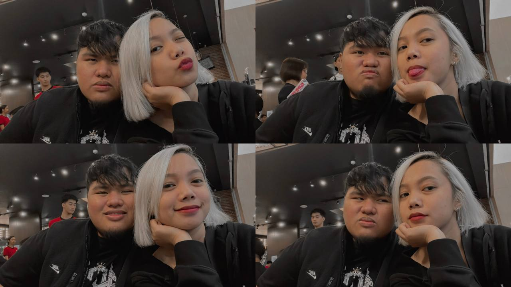
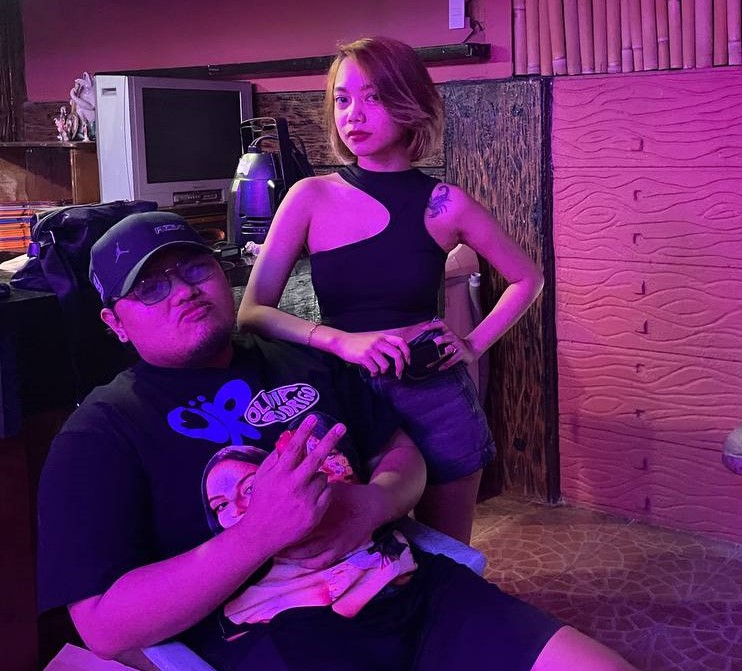

[index.html](https://github.com/user-attachments/files/25205221/index.html)
<!DOCTYPE html>
<html lang="en">
<head>
  <meta charset="UTF-8" />
  <meta name="viewport" content="width=device-width, initial-scale=1.0" />
  <title>A Card for Ysabella 🖤🌹</title>

  <!-- Fonts -->
  <link href="https://fonts.googleapis.com/css2?family=Great+Vibes&family=Patrick+Hand&family=Playfair+Display:wght@500;600&display=swap" rel="stylesheet">

  
</head>
<body>

<audio id="bgMusic" loop>
  <source src="sparkle-piano-violin.mp3" type="audio/mpeg">
</audio>

  <!-- Cover -->
  

    
Happy Valentine’s Day

    
For Ysabella 🖤

    
tap to open

  

  <!-- Page 1 -->
  

    

    

    

      We’ve had a lot of problems lately, like you said… but even with all of that, I still love you deeply.
    

  

  <!-- Page 2 -->
  

    

    

    

      I love your smile that brightens my day, your bungisngis, your eyes that are sometimes scary but mostly lovely.  
      I love your pouty lips that I always want to kiss, your nose that I want beside my face when we cuddle, your voice that I always want to hear kahit ayaw mo akong kantahan.
    

  

  <!-- Page 3 -->
  

    

    

      Every little trait — but most of all, your heart. Even with its edge, it’s still kind, lovable, and the one I choose.
    

    
Will you be my Valentine? 🌹

    

      <button onclick="event.stopPropagation(); yes()">Yes</button>
      <button onclick="event.stopPropagation(); no(this)">No</button>
    

  

  <!-- Final -->
  

    

      Happy Valentine’s Day 🌹
      
always yours, boop

    

  

</body>
</html>
